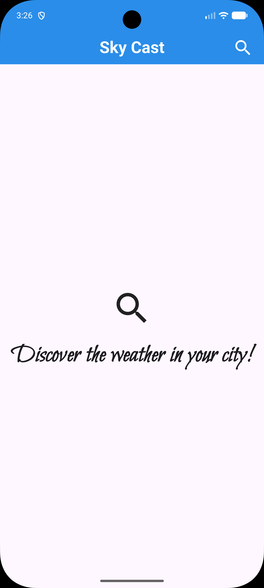
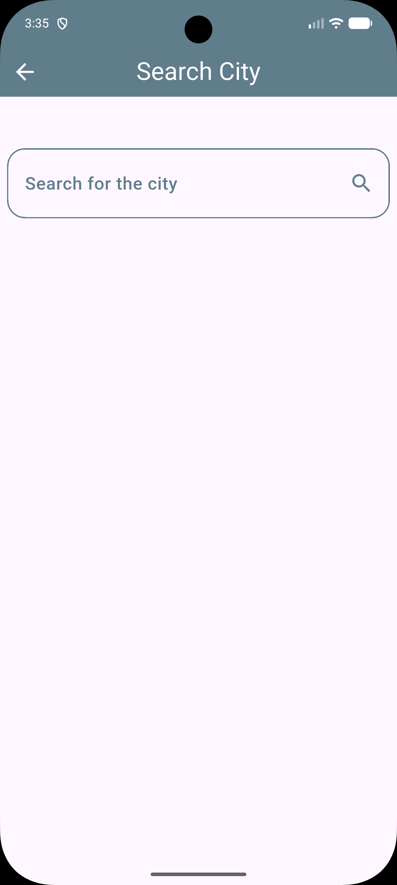
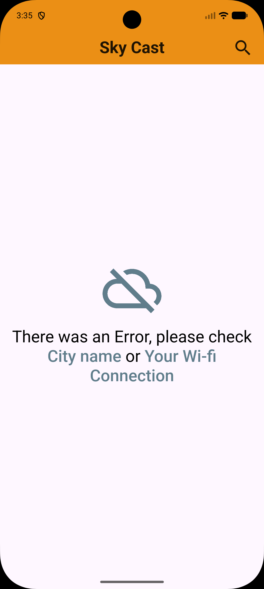
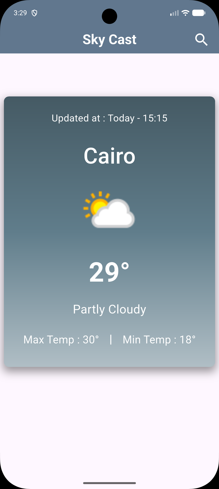
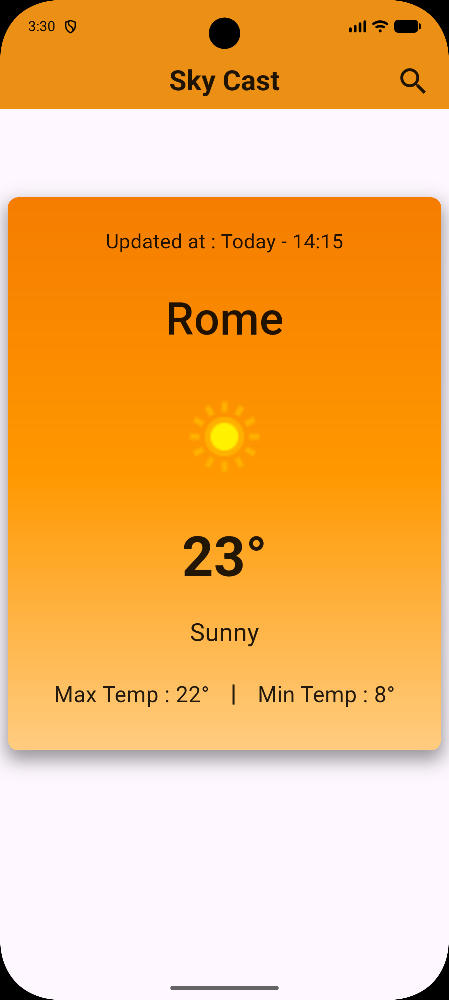
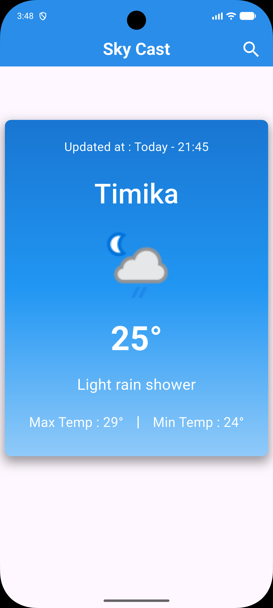

<div align="center">

# ☁️ Sky-Cast

[](https://flutter.dev)
[](https://dart.dev)
[](LICENSE)
[](https://flutter.dev)

**A sleek, minimal weather app built with Flutter, featuring real-time forecasts, beautiful adaptive UI, and Clean Architecture.**

[📱 Demo Video](#-demo-video) • [✨ Features](#-features) • [📸 Screenshots](#-screenshots) • [🏗️ Architecture](#-architecture) • [🚀 Getting Started](#-getting-started) • [👤 Author](#-author)

</div>

---

## 📱 Demo Video

<div align="center">

### 🎬 Watch Sky-Cast in Action

**[🔗 Watch on YouTube Shorts](https://youtube.com/shorts/GHmA_JNi-kw)**

*A quick showcase of the app's UI and features.*

</div>

---

## 🎯 Overview

**Sky-Cast** is a modern Flutter weather application utilizing Clean Architecture and real-time data from [WeatherAPI.com](https://www.weatherapi.com/). It delivers a seamless, adaptive, and beautiful user experience. Designed as a portfolio project demonstrating best practices in mobile development.

---

## ✨ Features

### 🏆 Core Features
- **Search by City** — Instantly fetch weather for any city worldwide
- **Current Conditions** — Status, temp, min/max, last update, and animated icons
- **Dynamic Theming** — UI colors adapt to the actual weather
- **Smart Error Handling** — Friendly messages for connectivity and input issues
- **Smooth Transitions** — Stylish, minimal layout with fast navigation
- **Material Design 3** — Latest UI patterns and standards

### ⚙️ Technical Highlights
- **Clean Architecture** — Clear separation of presentation, domain, and data
- **BLoC (Cubit) State Management** — Predictable, scalable logic
- **Dio Networking** — Robust and efficient HTTP client
- **Extensible Models** — Defensive parsing for API responses
- **Highly Responsive UI** — Sharp design on any device

---

## 📸 Screenshots

<div align="center">

| 🏠 Main Screen | 🔍 City Search | 🌤️ Weather Card |
|:-------------:|:--------------:|:---------------:|
|  |  |  |
| Live weather display | Type and search city | Real-time weather details |

| ❌ Error State | 🎨 Theme 1 | 🎨 Theme 2 |
|:-------------:|:----------:|:----------:|
|  |  |  |
| User-friendly error UI | Sunny/Clear theme | Cloudy/Fog theme |

| 🎨 Theme 3 | 🎨 Theme 4 |
|:----------:|:----------:|
|  |  |
| Rain/Drizzle theme | Thunder/Snow theme |

</div>

---

## 🛠️ Technical Stack

<div align="center">

| Component         | Technology      | Purpose                  |
|:-----------------:|:--------------:|:------------------------:|
| **Framework**     | Flutter 3.x    | Cross-platform UI        |
| **Language**      | Dart 3.x       | Core development         |
| **HTTP Client**   | Dio ^5.x       | Weather API calls        |
| **State Mgmt**    | flutter_bloc   | UI logic/state (Cubit)   |
| **Design**        | Material 3     | Latest UI patterns       |
| **API**           | WeatherAPI.com | Real-time weather data   |
| **Icons**         | Material       | Built-in weather icons   |

</div>

---

## 🏗️ Architecture

### 📁 Project Structure

```
lib/
├── main.dart                          # App entry & dynamic theme logic
│
├── Cubits/                            # 🧠 State management (BLoC/Cubit)
│   └── get Weather Cubit/
│       ├── get_Weather_Cubit.dart     # Weather fetch logic & emit states
│       └── get_Weather_States.dart    # State classes (initial, success, failed)
│
├── Models/                            # 📊 Data models
│   └── City_Weather_Model.dart        # CityWeatherModel with parsing
│
├── Services/                          # 🔌 API integrations
│   └── Weather_Services.dart          # Dio calls to WeatherAPI & response parsing
│
├── Views/                             # 🎬 UI Screens
│   ├── Main_View.dart                 # Home screen with weather card & search
│   └── Search_View.dart               # City search input with themed UI
│
├── Widgets/                           # 🧩 Reusable UI Components
│   ├── Weather_Card_Widget.dart       # Main weather display card
│   └── No_Weather_Search_Widget.dart  # Empty state & error UI
│
└── helper/                            # 🔧 Utilities
    ├── Theme_helper.dart              # Dynamic MaterialColor from weather status
    └── Text_Color_helper.dart         # Adaptive text contrast (black/white)
```

### 🔄 Data Flow

```
┌─────────────┐     ┌─────────────┐     ┌─────────────┐     ┌─────────────┐
│   Views     │────▶│   Cubit     │────▶│  Services   │────▶│ WeatherAPI  │
│  (Widgets)  │◀────│   (State)   │◀────│   (Dio)     │◀────│    .com     │
└─────────────┘     └─────────────┘     └─────────────┘     └─────────────┘
      │
      ▼
┌─────────────┐
│   Models    │
│ (fromJson)  │
└─────────────┘
```

**State Management:** BLoC (Cubit) pattern with 3 states:
```dart
// States
class initialState extends WeatherState {}           // App launch / no data
class SuccessfulWeatherState extends WeatherState {} // Weather loaded
class FailedWeatherState extends WeatherState {       // Error occurred
  FailedWeatherState(String errorMessage);
}

// Cubit usage
BlocProvider.of<GetWeatherCubit>(context).getWeather("Cairo");
```

---

## 🌐 API Integration

**Base URL:** `https://api.weatherapi.com/v1`

| Endpoint | Method | Service Class | Response |
|:---------|:------:|:--------------|:---------|
| `/forecast.json` | `GET` | `WeatherServices` | `CityWeatherModel` |

**Parameters:**
- `key` — API key (required)
- `q` — City name (required)
- `days` — Forecast days (1 for current)

**HTTP Client:** Dio with error handling.

**Example Response:**
```json
{
  "location": {
    "name": "Cairo",
    "country": "Egypt"
  },
  "current": {
    "last_updated": "2026-04-24 17:00",
    "temp_c": 28.5,
    "condition": {
      "text": "Sunny",
      "icon": "//cdn.weatherapi.com/weather/64x64/day/113.png"
    }
  },
  "forecast": {
    "forecastday": [{
      "day": {
        "maxtemp_c": 32.0,
        "mintemp_c": 22.0
      }
    }]
  }
}
```

---

## 🧩 Data Models

### CityWeatherModel
```dart
class CityWeatherModel {
  final DateTime requestTime;      // Last update timestamp
  final String name;               // City name
  final String weatherImagePath;   // Weather icon URL
  final double temperature;        // Current temp in °C
  final String status;             // Weather condition text
  final double maxTemp;            // Max temp in °C
  final double minTemp;            // Min temp in °C

  CityWeatherModel({
    required this.requestTime,
    required this.name,
    required this.weatherImagePath,
    required this.temperature,
    required this.status,
    required this.maxTemp,
    required this.minTemp,
  });
}
```

---

## 🎨 Dynamic Theme System

### Weather-Based Colors
```dart
MaterialColor getThemeColor(String? condition) {
  final status = condition?.toLowerCase().trim() ?? '';

  if (status == 'sunny' || status == 'clear')      return Colors.orange;
  if (status.contains('cloudy') || status == 'overcast' || 
      status.contains('mist') || status.contains('fog')) 
                                                   return Colors.blueGrey;
  if (status.contains('thunder'))                  return Colors.deepPurple;
  if (status.contains('rain') || status.contains('drizzle') || 
      status.contains('shower'))                     return Colors.blue;
  if (status.contains('snow') || status.contains('sleet') || 
      status.contains('blizzard') || status.contains('ice')) 
                                                   return Colors.cyan;

  return Colors.amber; // Default
}
```

### Adaptive Text Contrast
```dart
Color getAdaptiveContentColor(Color backgroundColor) {
  return ThemeData.estimateBrightnessForColor(backgroundColor) == Brightness.dark
      ? Colors.white
      : Colors.black87;
}
```

**Applied dynamically to:** AppBar, Weather Card background, text, icons, and input borders.

---

## 📦 Dependencies

```yaml
dependencies:
  flutter:
    sdk: flutter
  dio: ^5.x.x              # HTTP client for API calls
  flutter_bloc: ^8.x.x     # BLoC/Cubit state management
```

```bash
flutter pub get
```

---

## 🚀 Getting Started

### 📋 Prerequisites

| Requirement   | Version   | Purpose           |
|:-------------:|:---------:|:-----------------:|
| Flutter SDK   | >=3.0.0   | Framework         |
| Dart SDK      | >=3.0.0   | Language          |
| WeatherAPI    | Free key  | Weather data      |

### 💻 Installation

```bash
# 1. Clone the repository
git clone https://github.com/ahmed-el-bialy/Sky-Cast.git
cd Sky-Cast

# 2. Install dependencies
flutter pub get

# 3. Set your WeatherAPI key in lib/Services/Weather_Services.dart
#    final String apiKey = "YOUR_API_KEY_HERE";

# 4. Run the app
flutter run

# Build for production
flutter build apk --release      # Android
flutter build ios --release      # iOS
```

---

## ⚠️ Known Limitations

| Issue                  | Details                              | Status             |
|:-----------------------|:-------------------------------------|:------------------:|
| API key in source code | Hardcoded in Weather_Services.dart   | 🔧 Planned fix     |
| No offline mode        | Requires active internet connection  | 🔧 Planned         |
| No favorites/history   | No city persistence between sessions | 🔧 Planned         |
| No multi-day forecast  | Only current day displayed           | 🔧 Planned         |
| No localization        | English only                         | 🔧 Planned         |

---

## 🔮 Roadmap

- [ ] Secure API key management (environment variables)
- [ ] Add city favorites & local persistence (Hive/SharedPreferences)
- [ ] Multi-day forecast support (3-day / 7-day)
- [ ] Localization (Arabic, English, French)
- [ ] Unit & widget tests
- [ ] Improved accessibility (screen reader support)
- [ ] Weather alerts & notifications
- [ ] Animated weather backgrounds

---

## 🤝 Contributing

Contributions are welcome!

1. **Fork** the repo
2. **Create** a branch: `git checkout -b feature/your-feature`
3. **Commit**: `git commit -m 'Add awesome feature'`
4. **Push**: `git push origin feature/your-feature`
5. **Open** a Pull Request

---

## 📄 License

This project is licensed under the **MIT License** — see [LICENSE](LICENSE) for details.

---

## 👤 Author

**Ahmed El-Bialy**  
*Flutter Developer | Mobile App Specialist*

<div align="center">

[](https://www.linkedin.com/in/ahmedel-bialy/)
[](mailto:ah.elbialy.dev@gmail.com)
[](tel:+201022121573)
[](https://github.com/ahmed-el-bialy)

</div>

📧 **Email:** ah.elbialy.dev@gmail.com  
📞 **Phone:** +20 102 212 1573

---

<div align="center">

### ⭐ Star this repo if you found it helpful!

**Built with ❤️ by Ahmed El-Bialy**

</div>
