<div align="center">

<h1>🌤️ Sky-Cast</h1>

<p>
  <a href="https://flutter.dev">
    
  </a>
  <a href="https://dart.dev">
    
  </a>
  <a href="LICENSE">
    
  </a>
  <a href="https://flutter.dev">
    
  </a>
</p>

<p><strong>A sleek, minimal weather app built with Flutter, featuring real-time forecasts, beautiful adaptive UI, autocomplete city search, and Clean Architecture.</strong></p>

<p>
  <a href="#-demo-video">🎬 Demo Video</a> • 
  <a href="#-features">✨ Features</a> • 
  <a href="#-screenshots">📸 Screenshots</a> • 
  <a href="#-architecture">🏗️ Architecture</a> • 
  <a href="#-getting-started">🚀 Getting Started</a> • 
  <a href="#-author">👤 Author</a>
</p>

</div>

---

<div align="center">

## 🎬 Demo Video

### 📱 Watch Sky-Cast in Action

**[▶️ Watch on YouTube Shorts](https://youtube.com/shorts/GHmA_JNi-kw)**

*A quick showcase of the app's UI, dynamic themes, and smooth search experience.*

</div>

---

<div align="center">

## 📖 Overview

</div>

**Sky-Cast** is a modern Flutter weather application utilizing Clean Architecture and real-time data from [WeatherAPI.com](https://www.weatherapi.com/). It delivers a seamless, adaptive, and beautiful user experience with intelligent city search suggestions and dynamic theming that adapts to the actual weather conditions. Designed as a portfolio project demonstrating best practices in mobile development.

---

<div align="center">

## ✨ Features

</div>

### 🎯 Core Features
- **Smart City Search** 🔍 Autocomplete search with real-time city suggestions from WeatherAPI
- **Current Conditions** 🌡️ Status, temperature, min/max, humidity, wind speed, and animated icons
- **Dynamic Theming** 🎨 UI colors adapt to the actual weather condition (Sunny, Cloudy, Rainy, Thunder, Snow, etc.)
- **Adaptive Text Contrast** 📝 Smart white/black text switching based on theme brightness
- **Hero Weather Section** 🦸 Beautiful hero layout with cached weather icons
- **Smart Error Handling** ⚠️ Friendly messages for connectivity, spelling, and input issues
- **Smooth Transitions** ✨ Stylish, minimal layout with fast navigation and custom search delegate
- **Material Design 3** 🧩 Latest UI patterns and standards

### 🛠️ Technical Highlights
- **Clean Architecture** 🏗️ Clear separation of presentation, domain, and data layers
- **BLoC (Cubit) State Management** 🧠 Predictable, scalable logic with 3 states (Initial, Success, Failed)
- **Dio Networking** 🌐 Robust HTTP client with error handling and pretty logging
- **Autocomplete API** 🏙️ Real-time city suggestions using WeatherAPI Search endpoint
- **Cached Network Images** 🖼️ Efficient image loading with placeholder and error widgets
- **JSON Serializable Models** 📦 Auto-generated code for clean JSON parsing
- **Custom Search Delegate** 🔎 Fully themed search interface with adaptive colors
- **Native Splash & Icons** 📱 Configured launcher icons and splash screen for Android
- **Highly Responsive UI** 📐 Sharp design on any device size

---

<div align="center">

## 📸 Screenshots

</div>

<div align="center">

### 📱 App Launch

| 🎯 App Icon | 🚀 Splash Screen |
|:-----------:|:---------------:|
| 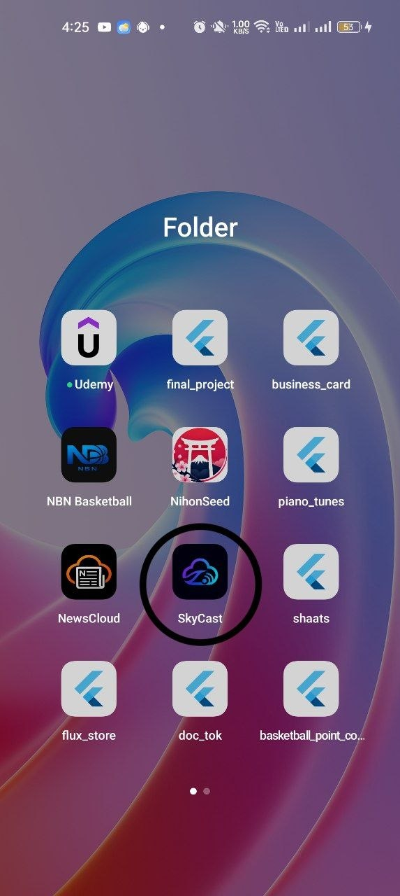 | 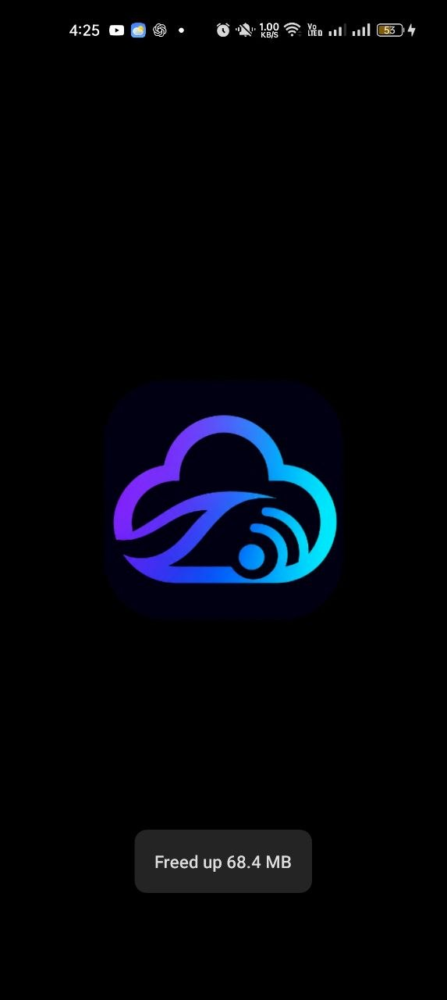 |
| Sky-Cast on your home screen | Elegant dark splash screen |

### 🎨 Default Theme

| 🏠 Main Screen | 🔍 Initial Search | 📋 Search Results |
|:-------------:|:----------------:|:----------------:|
| 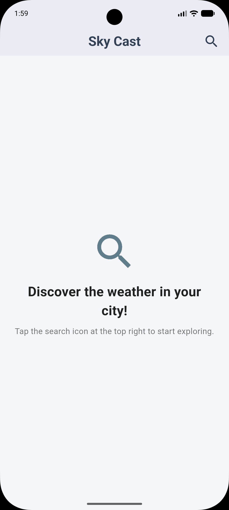 | 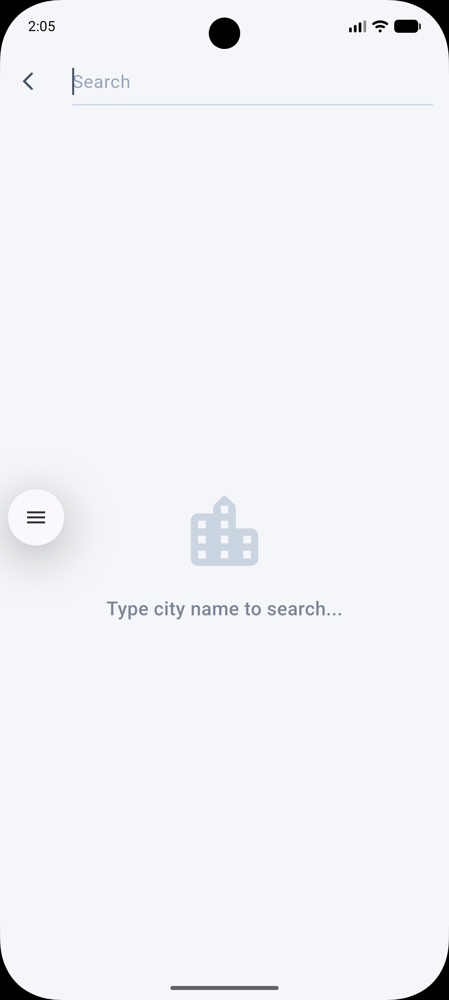 | 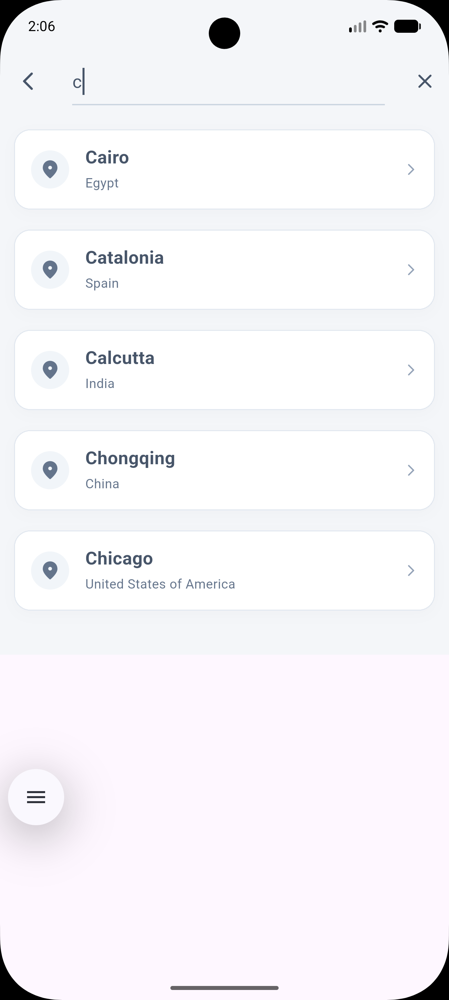 |
| Discover your city weather | Type to search with suggestions | Real-time city results |

### ☀️ Sunny Theme

| 🏠 Main Screen | 🔍 Initial Search | 📋 Search Results |
|:-------------:|:----------------:|:----------------:|
| 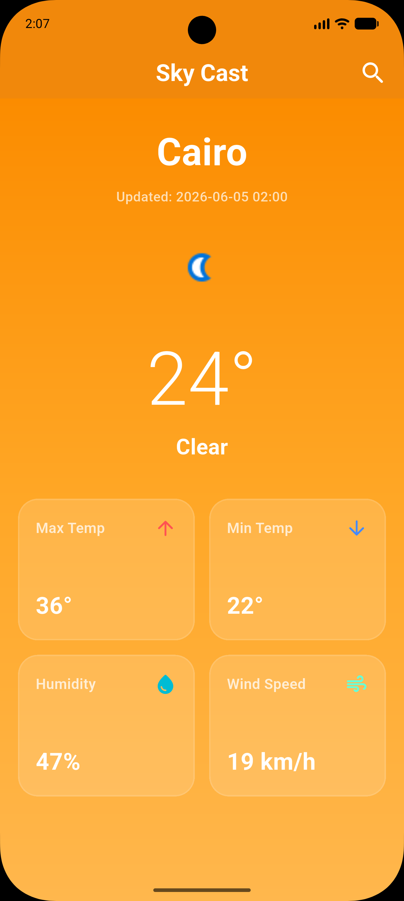 | 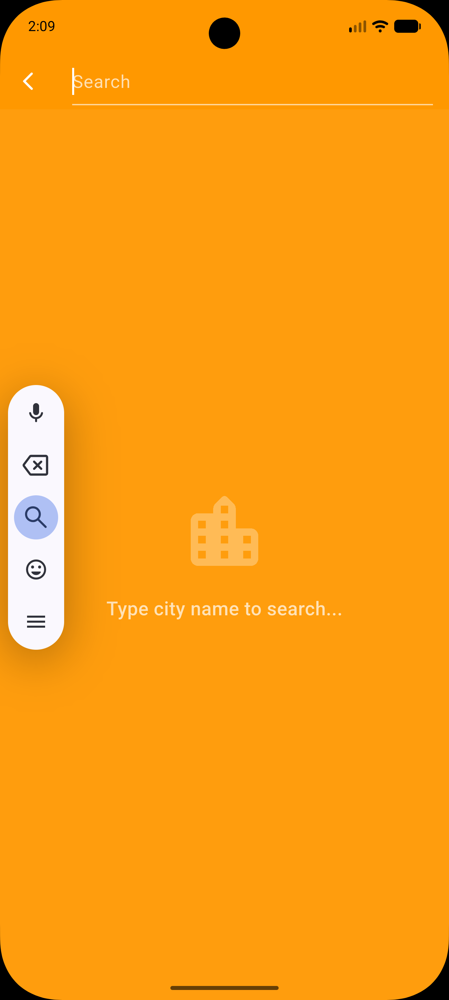 | 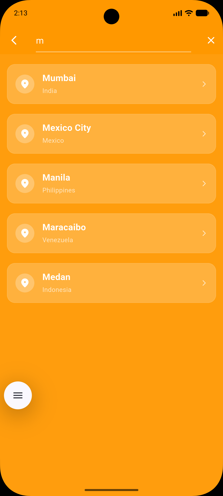 |
| Bright orange theme | Sunny search UI | Results with warm colors |

### ⛈️ Thunder Theme

| 🏠 Main Screen | 🔍 Initial Search |
|:-------------:|:----------------:|
| 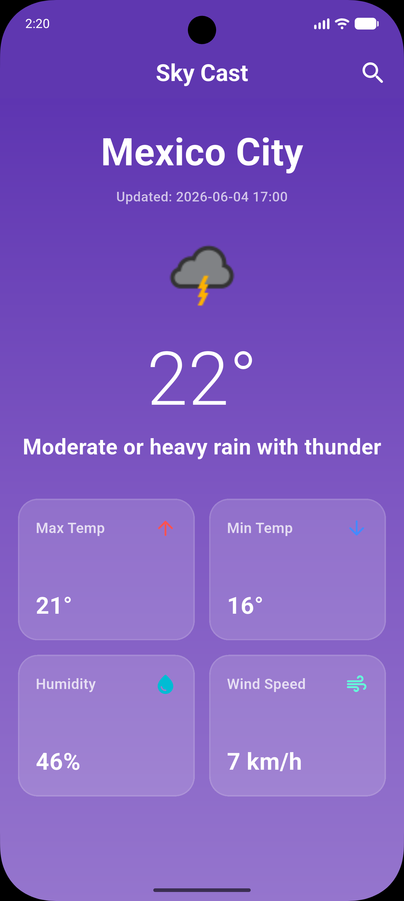 | 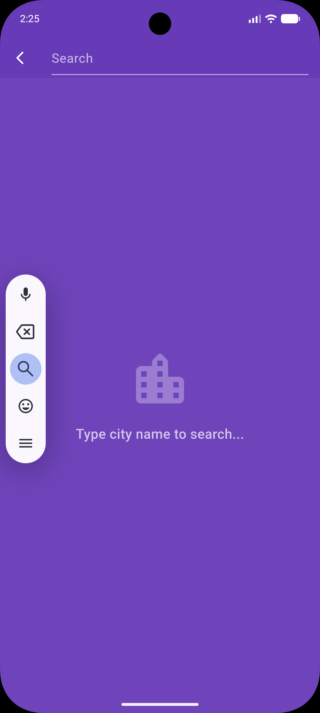 |
| Deep purple storm theme | Dark search interface |

### ☁️ Cloudy Theme

| 🏠 Main Screen | 🔍 Initial Search | 📋 Search Results |
|:-------------:|:----------------:|:----------------:|
| 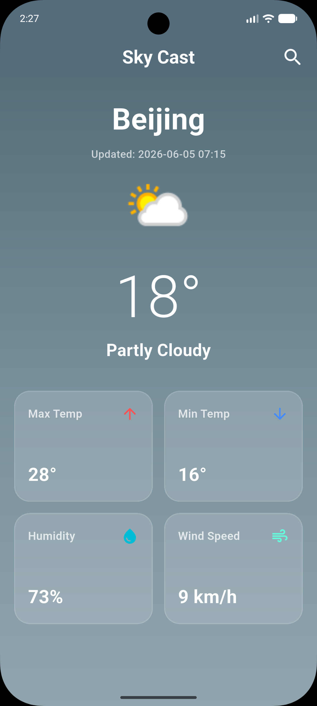 | 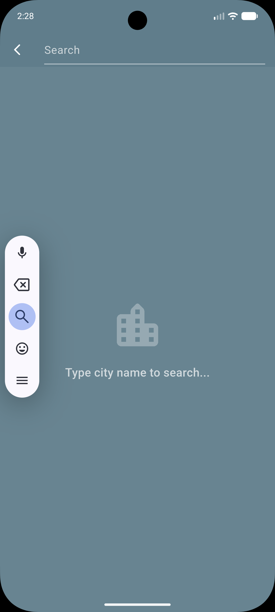 | 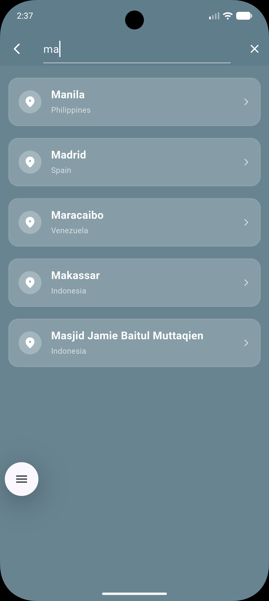 |
| Blue-grey overcast theme | Muted search UI | Cloudy results view |

### 🌧️ Rainy Theme

| 🏠 Main Screen | 🔍 Initial Search | 📋 Search Results |
|:-------------:|:----------------:|:----------------:|
| 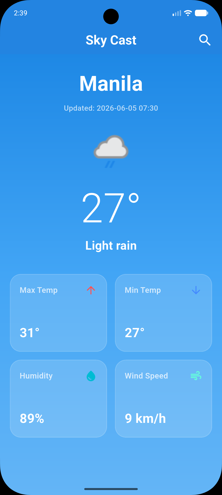 | 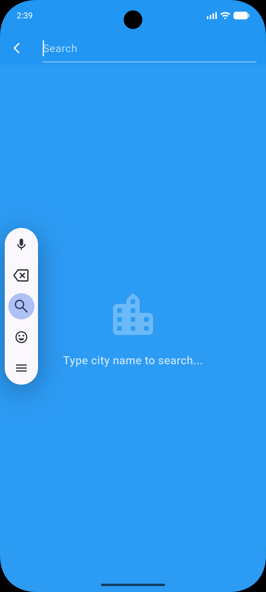 | 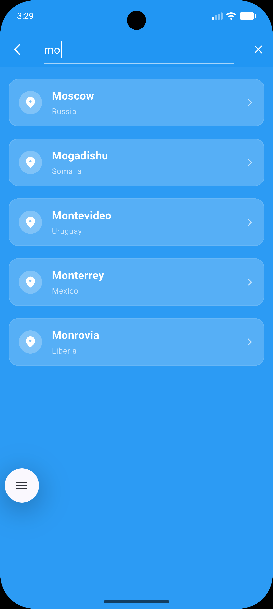 |
| Cool blue rain theme | Rainy search interface | Wet weather results |

### ❄️ Snowy Theme

| 🏠 Main Screen | 🔍 Initial Search | 📋 Search Results |
|:-------------:|:----------------:|:----------------:|
| 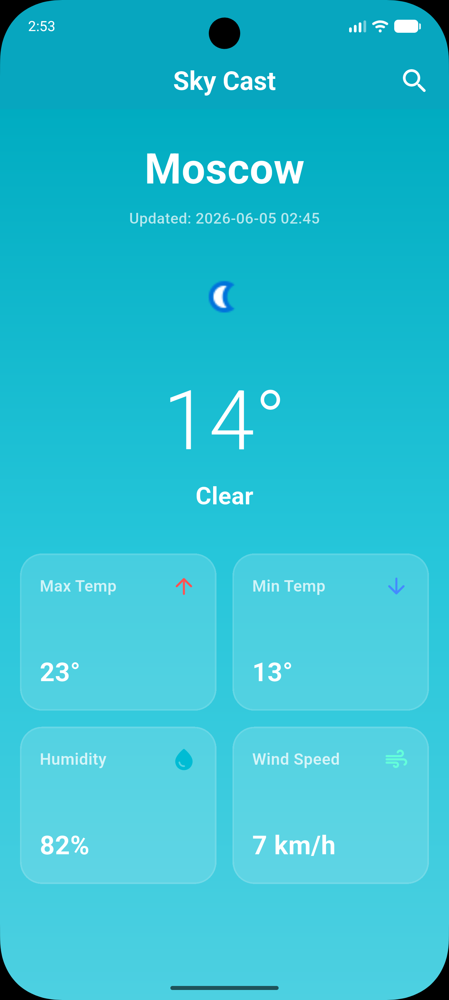 | 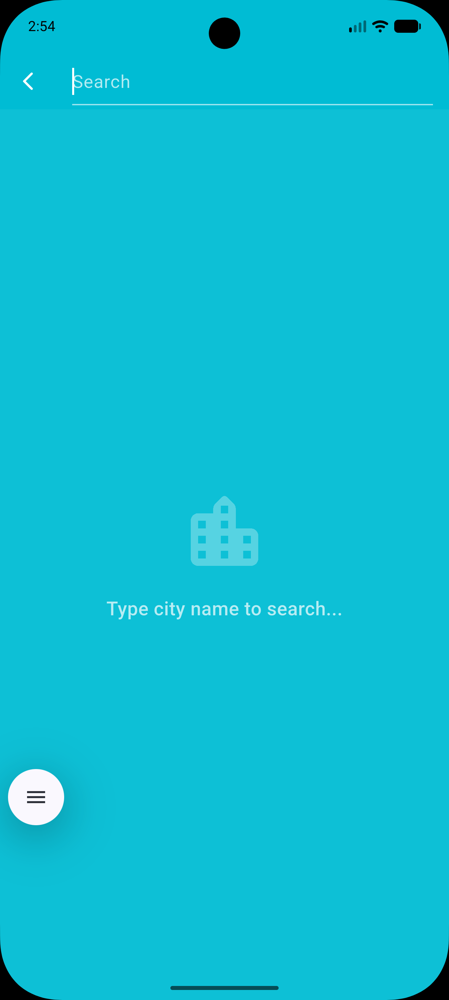 | 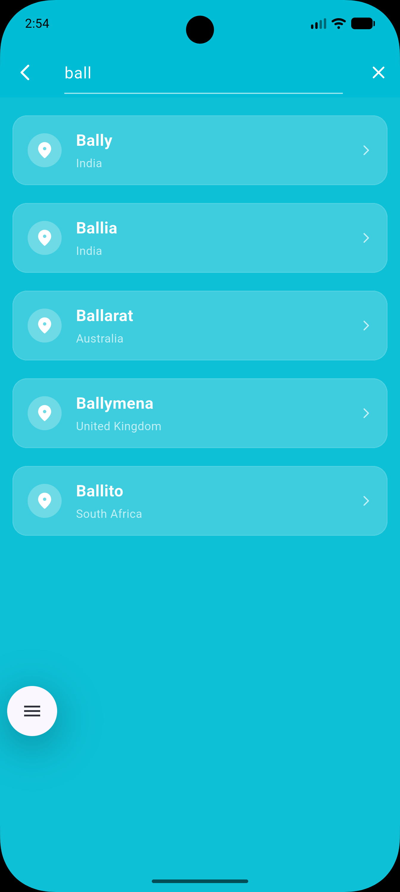 |
| Cyan winter theme | Snowy search UI | Freezing results view |

### 🔧 App Features

| ⌨️ Search Icon | ⚠️ Error State | 🚫 No Results |
|:-------------:|:-------------:|:-------------:|
| 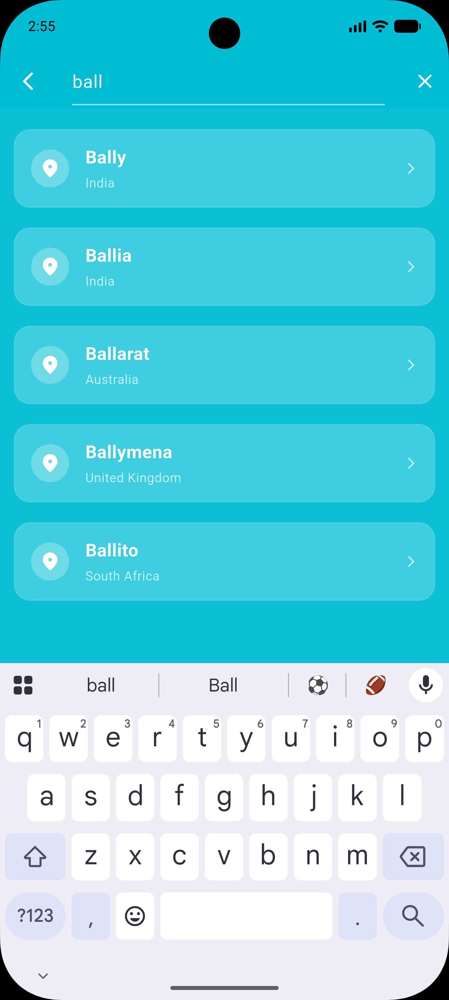 | 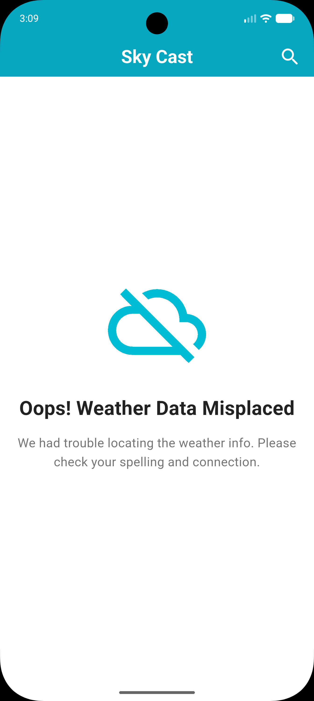 | 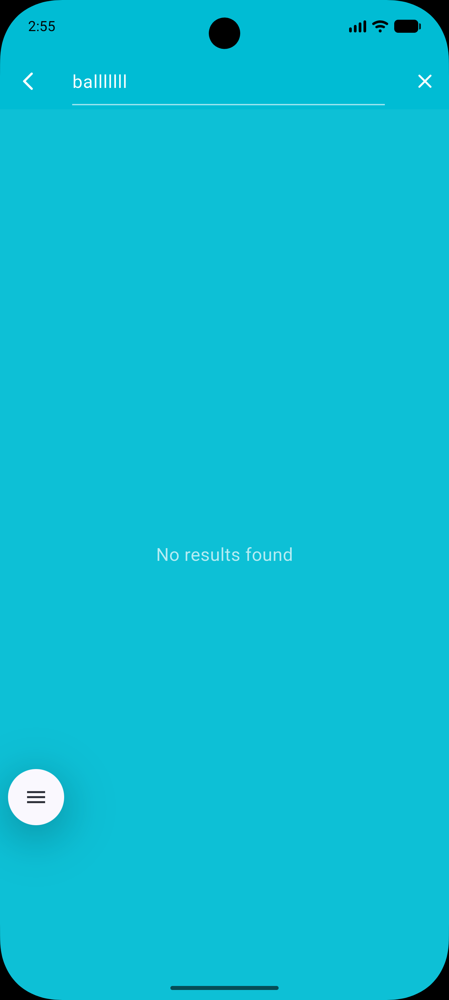 |
| Keyboard action: Search | Friendly error UI | Empty suggestions state |

> **Note:** The AppBar dynamically adapts its theme color based on the current weather condition, while the rest of the search interface follows the same adaptive color system.

> **Note:** Some screenshots are demo/test data used to showcase specific weather conditions and may not reflect real-time data.

</div>

---

<div align="center">

## 🛠️ Technical Stack

</div>

<div align="center">

| Component | Technology | Purpose |
|:---------:|:----------:|:-------:|
| **Framework** | Flutter 3.x | Cross-platform UI |
| **Language** | Dart 3.x | Core development |
| **HTTP Client** | Dio ^5.x | Weather API calls |
| **State Management** | flutter_bloc ^9.x | BLoC/Cubit pattern |
| **Screen Adaptation** | flutter_screenutil ^5.x | Responsive design |
| **Image Caching** | cached_network_image ^3.x | Weather icon loading |
| **JSON Parsing** | json_annotation ^4.x | Model serialization |
| **Design** | Material 3 | Latest UI patterns |
| **API** | WeatherAPI.com | Real-time weather & search data |
| **Icons** | Material | Built-in weather icons |
| **Splash Screen** | flutter_native_splash ^2.x | Native launch screen |
| **Launcher Icons** | flutter_launcher_icons ^0.14.x | App icon generation |
| **API Tools** | retrofit ^4.x | Type-safe API calls |
| **Logging** | pretty_dio_logger ^1.x | HTTP request logging |

</div>

---

<div align="center">

## 🏗️ Architecture

</div>

### 📁 Project Structure

```
lib/
├── main.dart                          # App entry & dynamic theme logic
│
├── cubits/                            # 🧠 State management (BLoC/Cubit)
│   └── get_weather_cubit/
│       ├── get_weather_cubit.dart     # Weather fetch & city search logic
│       └── get_weather_states.dart    # State classes (Initial, Success, Failed)
│
├── models/                            # 📦 Data models
│   ├── city_suggestion_model.dart     # CitySuggestionModel with JSON parsing
│   └── city_weather_model.dart       # CityWeatherModel with nested classes
│
├── services/                          # 🌐 API integrations
│   └── weather_services.dart          # Dio calls to WeatherAPI & response parsing
│
├── views/                             # 🖼️ UI Screens
│   ├── main_view.dart                 # Home screen with adaptive AppBar & search
│   └── error_view.dart                # Friendly error display
│
├── widgets/                           # 🧩 Reusable UI Components
│   ├── weather_card.dart              # Main weather display with gradient
│   ├── hero_weather_section.dart      # Hero section: city, temp, icon, condition
│   ├── info_card.dart                 # Stat cards (Max/Min Temp, Humidity, Wind)
│   ├── custom_search_delegate.dart    # Themed search with autocomplete
│   ├── city_suggestion_card.dart      # City suggestion list item
│   ├── initial_search_body.dart       # Empty search state with themed background
│   ├── main_body.dart                 # State-based body switcher
│   └── no_weather_search.dart         # Initial app state (no city selected)
│
└── helper/                            # 🛠️ Utilities
    ├── constants.dart                 # API base URL & API key
    ├── theme_helper.dart              # Dynamic MaterialColor from weather status
    └── text_color_helper.dart         # Adaptive text contrast (black/white)
```

### 🔄 Data Flow

```
┌─────────────┐     ┌─────────────┐     ┌─────────────┐     ┌─────────────┐
│   Views     │◄────│   Cubit     │◄────│  Services   │◄────│ WeatherAPI  │
│  (Widgets)  │     │   (State)   │     │   (Dio)     │     │    .com     │
└─────────────┘     └─────────────┘     └─────────────┘     └─────────────┘
       │
       │
┌─────────────┐
│   Models    │
│ (fromJson)  │
└─────────────┘
```

### 🧠 State Management

**BLoC (Cubit) pattern with 3 states:**

```dart
// States
class InitialState extends GetWeatherState {}           // App launch / no data
class SuccessfulWeatherState extends GetWeatherState {} // Weather loaded
class FailedWeatherState extends GetWeatherState {       // Error occurred
  FailedWeatherState(String errorMessage);
}

// Cubit usage
BlocProvider.of<GetWeatherCubit>(context).getWeather("Cairo");
```

---

<div align="center">

## 🔌 API Integration

</div>

**Base URL:** `https://api.weatherapi.com/v1`

| Endpoint | Method | Service Class | Response |
|:---------|:------:|:--------------|:---------|
| `/forecast.json` | `GET` | `WeatherServices.getWeather()` | `CityWeatherModel` |
| `/search.json` | `GET` | `WeatherServices.getAutocompleteCities()` | `List<CitySuggestionModel>` |

**Parameters:**
- `key` — API key (required)
- `q` — City name (required)
- `days` — Forecast days (1 for current)

**HTTP Client:** Dio with `pretty_dio_logger` for debugging and comprehensive error handling.

**Example Response (Weather):**
```json
{
  "location": {
    "name": "Cairo",
    "country": "Egypt"
  },
  "current": {
    "last_updated": "2026-04-24 17:00",
    "temp_c": 28.5,
    "humidity": 45,
    "wind_kph": 12.5,
    "condition": {
      "text": "Sunny",
      "icon": "//cdn.weatherapi.com/weather/64x64/day/113.png"
    }
  },
  "forecast": {
    "forecastday": [{
      "day": {
        "maxtemp_c": 32.0,
        "mintemp_c": 22.0
      }
    }]
  }
}
```

**Example Response (Search Suggestions):**
```json
[
  {
    "name": "London",
    "country": "United Kingdom"
  },
  {
    "name": "London",
    "country": "Canada"
  }
]
```

---

<div align="center">

## 📦 Data Models

</div>

### CityWeatherModel
```dart
class CityWeatherModel {
  final LocationModel location;      // City name & metadata
  final CurrentModel current;        // Current weather data
  final ForecastModel forecast;      // Forecast data (max/min temp)

  CityWeatherModel({
    required this.location,
    required this.current,
    required this.forecast,
  });
}
```

### CitySuggestionModel
```dart
class CitySuggestionModel {
  final String name;                 // City name
  final String country;              // Country name

  CitySuggestionModel({
    required this.name,
    required this.country,
  });
}
```

---

<div align="center">

## 🎨 Dynamic Theme System

</div>

### Weather-Based Colors
```dart
MaterialColor getThemeColor(String? condition) {
  if (condition == null || condition.trim().isEmpty) {
    return Colors.blue; // Default
  }

  final status = condition.toLowerCase().trim();

  if (status == 'sunny' || status == 'clear')     return Colors.orange;
  if (status.contains('cloudy') || status == 'overcast' || 
      status.contains('mist') || status.contains('fog')) 
                                                  return Colors.blueGrey;
  if (status.contains('thunder') || status.contains('thundery')) 
                                                  return Colors.deepPurple;
  if (status.contains('rain') || status.contains('drizzle') || 
      status.contains('shower'))                    return Colors.blue;
  if (status.contains('snow') || status.contains('sleet') || 
      status.contains('blizzard') || status.contains('ice') || 
      status.contains('freezing'))                return Colors.cyan;

  return Colors.amber; // Fallback
}
```

### Adaptive Text Contrast
```dart
Color getAdaptiveContentColor(Color? themeColor) {
  return themeColor == null ? const Color(0xFF475569) : Colors.white;
}

Color getAdaptiveHintColor(Color? themeColor) {
  return themeColor == null ? const Color(0xFF94A3B8) : Colors.white70;
}
```

**Applied dynamically to:** AppBar, Weather Card background, text, icons, input borders, search delegate, and suggestion cards.

---

<div align="center">

## 📱 Native Configuration

</div>

### Launcher Icons (`flutter_launcher_icons.yaml`)
```yaml
flutter_launcher_icons:
  android: true
  image_path: "assets/app_logo.png"
  adaptive_icon_background: "#111111"
  adaptive_icon_foreground: "assets/app_logo.png"
  image_ratio_android: 1.4
```

### Splash Screen (`flutter_native_splash.yaml`)
```yaml
flutter_native_splash:
  color: "#000000"
  color_dark: "#000000"
  image: assets/app_logo.png
  image_dark: assets/app_logo.png
  android_12:
    color: "#000000"
    image: assets/app_logo.png
    icon_background_color: "#000000"
    icon_background_color_dark: "#000000"
```

---

<div align="center">

## 📦 Dependencies

</div>

```yaml
dependencies:
  flutter:
    sdk: flutter
  cupertino_icons: ^1.0.9
  # State Management
  flutter_bloc: ^9.1.1
  # Networking
  dio: ^5.9.2
  retrofit: ^4.9.2
  pretty_dio_logger: ^1.4.0
  # UI & Screen
  flutter_screenutil: ^5.9.3
  cached_network_image: ^3.4.1
  # JSON Serialization
  json_annotation: ^4.12.0
  # Native Config
  flutter_native_splash: ^2.4.8
  flutter_launcher_icons: ^0.14.4
  rename: ^3.1.0

dev_dependencies:
  flutter_test:
    sdk: flutter
  flutter_lints: ^6.0.0
  json_serializable: ^6.14.0
  build_runner: ^2.15.0
  retrofit_generator: ^10.2.6
```

```bash
flutter pub get
```

---

<div align="center">

## 🚀 Getting Started

</div>

### 📋 Prerequisites

| Requirement | Version | Purpose |
|:-----------:|:-------:|:-------:|
| Flutter SDK | >=3.0.0 | Framework |
| Dart SDK | >=3.0.0 | Language |
| WeatherAPI | Free key | Weather data & search |

### ⚙️ Installation

```bash
# 1. Clone the repository
git clone https://github.com/ahmed-el-bialy/Sky-Cast.git
cd Sky-Cast

# 2. Install dependencies
flutter pub get

# 3. Generate JSON serializable code
flutter pub run build_runner build

# 4. Set your WeatherAPI key in lib/helper/constants.dart
#    const String apiKey = "YOUR_API_KEY_HERE";

# 5. Run the app
flutter run

# Build for production
flutter build apk --release      # Android
flutter build ios --release      # iOS
```

---

<div align="center">

## ⚠️ Known Limitations

</div>

| Issue | Details | Status |
|:------|:--------|:------:|
| API key in source code | Hardcoded in `constants.dart` | 🔧 Planned fix |
| No offline mode | Requires active internet connection | 🔧 Planned |
| No favorites/history | No city persistence between sessions | 🔧 Planned |
| No multi-day forecast | Only current day displayed | 🔧 Planned |
| No localization | English only | 🔧 Planned |

---

<div align="center">

## 🗺️ Roadmap

</div>

- [ ] Secure API key management (environment variables)
- [ ] Add city favorites & local persistence (Hive/SharedPreferences)
- [ ] Multi-day forecast support (3-day / 7-day)
- [ ] Localization (Arabic, English, French)
- [ ] Unit & widget tests
- [ ] Improved accessibility (screen reader support)
- [ ] Weather alerts & notifications
- [ ] Animated weather backgrounds

---

<div align="center">

## 🤝 Contributing

</div>

Contributions are welcome!

1. **Fork** the repo
2. **Create** a branch: `git checkout -b feature/your-feature`
3. **Commit**: `git commit -m 'Add awesome feature'`
4. **Push**: `git push origin feature/your-feature`
5. **Open** a Pull Request

---

<div align="center">

## 📄 License

</div>

This project is licensed under the **MIT License** — see [LICENSE](LICENSE) for details.

---

<div align="center">

## 👤 Author

</div>

**Ahmed El-Bialy**  
*Flutter Developer | Mobile App Specialist*

<div align="center">

<p>
  <a href="https://www.linkedin.com/in/ahmedel-bialy/">
    
  </a>
  <a href="mailto:ah.elbialy.dev@gmail.com">
    
  </a>
  <a href="tel:+201022121573">
    
  </a>
  <a href="https://github.com/ahmed-el-bialy">
    
  </a>
</p>

<p>
  📧 <strong>Email:</strong> ah.elbialy.dev@gmail.com<br>
  📱 <strong>Phone:</strong> +20 102 212 1573
</p>

</div>

---

<div align="center">

### ⭐ Star this repo if you found it helpful!

**Built with 💙 by Ahmed El-Bialy**

</div>